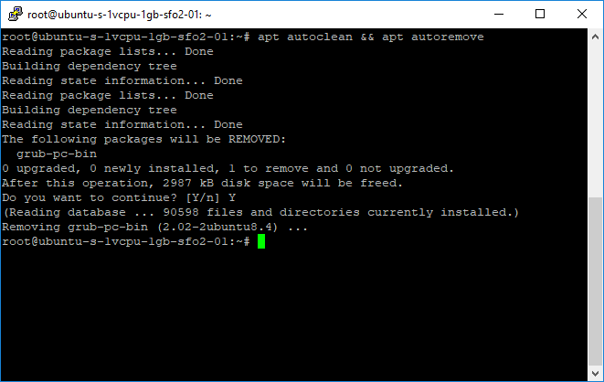
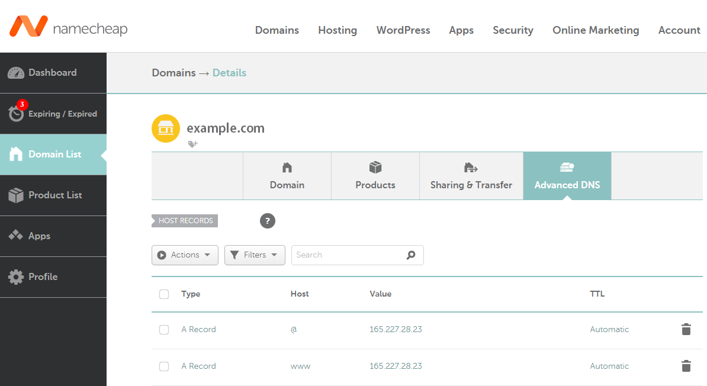
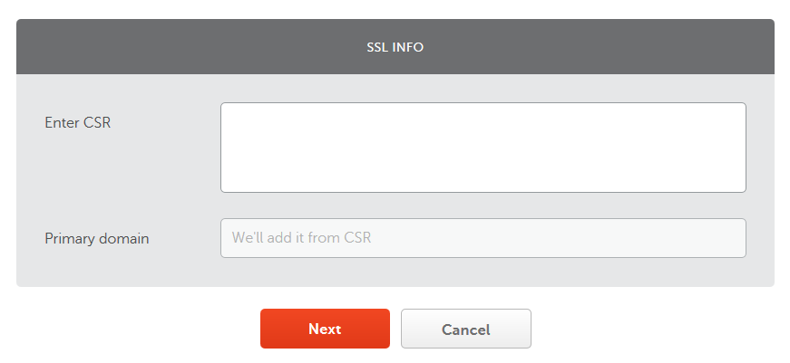
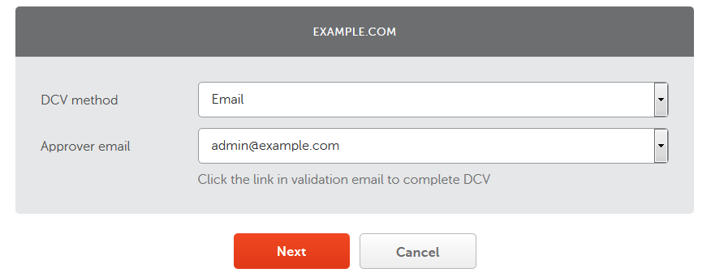
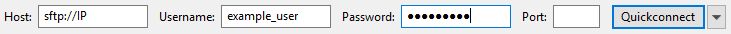
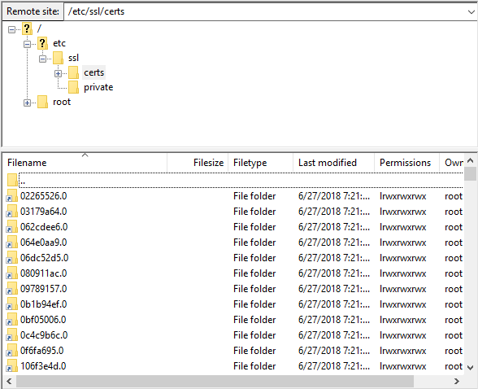

<p align = "center">
	
</p>

<table>
	<tr>
		<td align = "center">
			In this tutorial, you will learn how to integrate <a href = "https://github.com/OPSkins/trade-opskins-api">WAX ExpressTrade</a> into your website using <a href = "#nodejs">Node.js</a> or <a href = "#php">PHP</a>!
		</td>
	</tr>
	<tr>
		<td>
			<table>
				<td align = "center">
					<a href = "https://trade.opskins.com">WAX ExpressTrade</a>
				</td>
				<td align = "center">
					<a href = "https://github.com/OPSkins/trade-opskins-api">API Documentation for WAX ExpressTrade</a>
				</td>
				<td align = "center">
					<a href = "https://docs.opskins.com/public/en.html#oauth">Documentation for OPSkins OAuth</a>
				</td>
				<td align = "center">
					<a href = "https://blog.opskins.com/opskins-expresstrade">About WAX ExpressTrade</a>
				</td>
				<td align = "center">
					<a href = "https://opskins.com">Buy/Sell Tradable Skins & Items</a>
				</td>
			</table>
		</td>
	</tr>
</table>

#### Table of Contents

* [Node.js](#nodejs)
	* [Beginners](#beginners)
		* [Local Environment](#local-environment)
		* [Production Environment](#production-environment)
			* [Order/Create a VPS](#ordercreate-a-vps)
			* [Log In & Prepare Your VPS](#log-in--prepare-your-vps)
			* [Create a New User](#create-a-new-user)
			* [Install Dependencies](#install-dependencies)
			* [Register a Domain & Configure Name-based Virtual Hosts](#register-a-domain--configure-name-based-virtual-hosts)
	* [Create an OPSkins Account](#create-an-opskins-account)
	* [Install Dependencies](#install-dependencies-1)
* [PHP](#php)
	* [Beginners](#beginners-1)
		* [Local Environment](#local-environment-1)
		* [Production Environment](#production-environment-1)
			* [Order/Create a VPS](#ordercreate-a-vps-1)
			* [Log In & Prepare Your VPS](#log-in--prepare-your-vps-1)
			* [Create a New User](#create-a-new-user-1)
			* [Install Dependencies](#install-dependencies-2)
			* [Register a Domain & Configure Name-based Virtual Hosts](#register-a-domain--configure-name-based-virtual-hosts-1)
	* [Create an OPSkins Account](#create-an-opskins-account-1)
	* [Install Dependencies](#install-dependencies-3)

# Node.js

## Beginners

### Local Environment

### Production Environment

#### Order/Create a VPS

#### Log In & Prepare Your VPS

#### Create a New User

#### Install Dependencies

#### Register a Domain & Configure Name-based Virtual Hosts

## Create an OPSkins Account

## Install Dependencies

# PHP

## Beginners

Before anything, you will need to install a **web server** and **PHP**. If you already know how to do this and you're not interested in registering a domain alongside the configuration that comes with it, skip to the [next step](#install-dependencies-3). Otherwise, click [here](#register-a-domain--configure-name-based-virtual-hosts-1) for information related to registering a domain and its configuration!

> **Note**: Instructions related to setting up a **MySQL server** won't be addressed in this tutorial; however, it's recommended that you go forward with the process if you plan on creating a functional website that serves user accounts, saves their settings and/or stores any other data in general.

### Local Environment

If you aren't interested in setting up an environment for local development, you can skip directly to [setting up a production environment](#production-environment-1) (where you can publish your website so anyone can visit it) right off the bat.

---

A web server and PHP can be installed by many different means, although [XAMPP](https://www.apachefriends.org) is an all-in-one package that's incredibly easy to install and use; hence, it's a highly recommended option and you should definitely consider using it!

After installing XAMPP (or the above by any other mean), start **Apache** (or the web server):


Any website you create should be placed in the `htdocs` folder where you installed XAMPP. You can access one of your websites at `http://localhost/some-website` via a web browser, where `some-website` is the path to a specific website you wish to render.

### Production Environment

Hosting your website implies that you rent a **VPS** (*Virtual Private Server*) from a company of choice to keep it accessible 24/7. There are many companies you can rent a VPS from, although some may require that you submit a whitelist application beforehand (such as [OVH](https://www.ovh.com/world)). If you're looking for a decent VPS that's also quick to set up, [DigitalOcean](https://www.digitalocean.com) is an excellent option!

> **Note**: You can alternatively host your website with a dedicated web hosting provider (such as [HostGator](https://www.hostgator.com)), this would simplify the process a bit and can be a better option if your VPS provider doesn't provide strong protection against attacks using the default configuration. However, many dedicated web hosting providers disable certain features for security reasons - so if you want to be in complete control and/or plan on hosting more than one website while paying the same amount per month, a VPS would be the more convenient option!

#### Order/Create a VPS

Regardless of the company you decide to rent a VPS from, you must get it online with the **OS** (*Operating System*) of your choice installed. **Ubuntu** is recommended for beginners.


Typically after creating a VPS, its log in credentials are sent via email - have them ready because you'll need them in the next step!


> **Note**: Hosting a website on a Windows server is possible; however, it isn't recommended for beginners - many network adjustments must be applied to prevent attacks by third parties.

#### Log In & Prepare Your VPS

You will need an **SSH client** in order to log into your VPS. [PuTTY](https://www.chiark.greenend.org.uk/~sgtatham/putty/latest.html) is vastly recommended!

Run PuTTY (or the SSH client of your choice) and connect to your VPS:


A dialog titled `PuTTY Security Alert` will prompt, hit `Yes`:


Enter the username and password sent to you via email:


> **Note**: Passwords in the SSH client don't show whatsoever, not even as hidden characters (e.g. ••••••).

As stated in the email from DigitalOcean, you must change your password upon initially logging into your VPS for security reasons:


**(Optional)** Not all providers force you to change your password upon initially logging into your VPS, although it's recommended! You can alternatively change your password with the `passwd` command:


Check for and install all system updates by executing `apt update && apt upgrade`:


Remove any residue files by executing `apt autoclean && apt autoremove`:



#### Create a New User

No other command in this tutorial should be executed as `root` (except the ones below to create a new user). Create a new user and add it to the `sudo` group so you'll have administrative privileges:

- Create the user, replacing `example_user` with a username of your choice: `adduser example_user` (you'll be prompt to assign a password and enter information about the user)
- Add the user to the `sudo` group, replacing `example_user` with the username of the user you previously created: `adduser example_user sudo`
- Switch to the user, again by replacing `example_user`: `su example_user`

> **Note**: Log into your VPS with the credentials you previously created from here on out (add **sudo** to the beginning of a command if administrative privileges is required); although, you can always use the **su** command to switch to the user.

#### Install Dependencies

If you're using Ubuntu 18.04, use Tasksel to install a **LAMP stack** (*Linux, Apache, MySQL, PHP*):

`sudo tasksel install lamp-server`

**(Optional)** Otherwise, you can install **Apache** and **PHP** separately (or if you don't want **MySQL** to be installed altogether):
- Install Apache: `sudo apt install apache2`
- Install the base PHP package and the PHP Extension and Application Repository: `sudo apt install php php-pear`
- Add the PHP module for Apache: `sudo apt install libapache2-mod-php`

Any website you create should be placed in `/var/www/html`. You can access one of your websites at `http://IP/some-website` via a web browser, where `IP` is your VPS' IP address and `some-website` is the path to a specific website you wish to render.

#### Register a Domain & Configure Name-based Virtual Hosts

Your website (or at least the `Apache2 Ubuntu Default Page`) should be accessible at this point. It's recommended that you assign a domain to your website if you plan on having visitors from all around the world; however, it isn't technically necessary - your visitors would just have trouble remembering your VPS' IP address! If you do not wish to assign a domain to your website, skip to the [next step](#install-dependencies-3).

---

There are many companies you can register a domain with. [NameCheap](https://www.namecheap.com) & [GoDaddy](https://www.godaddy.com) are excellent domain name providers, and both have an active support team! Either one is highly recommended.

Before you go ahead and purchase a domain, decide whether you want an **SSL certificate** or not since purchasing one after you register a domain is often more expensive (or you must pay the full price - no discount)! An SSL certificate will encrypt your visitors' information, thus improving the security of your website - it is recommended that you install one!

> **Note**: You aren't forced to pay for a domain as there are free options (such as [.tk](http://www.dot.tk)), but you are limiting the array of extensions available to you - either way, it is to note that some people tend to stay away from websites with free domains; therefore, go with a paid domain if you're aiming for success!

After registering a domain of your choice, modify its **host records**, replacing `165.227.28.23` with your VPS' IP address:

* **Type**: A Record, **Host**: @, **Value**: 165.227.28.23, **TTL**: Automatic
* **Type**: A Record, **Host**: www, **Value**: 165.227.28.23, **TTL**: Automatic

> **Note**: **@** is a shortcut for the name defined as origin ([*$ORIGIN*](http://www.zytrax.com/books/dns/ch8/origin.html)) - basically your domain name which also represents the root directory. The second host record will accept requests with the **www** subdomain attached.



> **Note**: When a domain is newly registered, or DNS changes are made, you can expect a propagation time up to 24 hours.

---

**If you didn't purchase an SSL certificate, click [here](#if-you-purchased-an-ssl-certificate-click-here-to-continue) to continue.**

It's great that you have decided to install an SSL certificate to ensure that the information of your visitors is protected (such as passwords) - now you need to activate it! For that, you will need to generate a CSR:

`openssl req -new -newkey rsa:2048 -nodes -keyout server.key -out server.csr` (you'll be prompt to enter information)

Once you have entered all of the requested information, you should have a `.csr` and `.key` file in the path where you executed the command. Open the `.csr` file with `nano` (install it by executing `sudo apt install nano` if it doesn't come pre-installed), copy its content, then go to your provider's dashboard and start the process of activating your SSL certificate (you can find your SSL certificate listed under `Products` on NameCheap).

Enter what you copied from the `.csr` file:



Confirm that the selected server is correct (should be/include **Apache** if you've been following the steps in this tutorial):


Select your preferred validation method:



Go forward with the selected domain ownership validation process. At the end, typically two files in a compressed archive will be sent to you via email - download it! With a **FTP client** ([FileZilla](https://filezilla-project.org) is highly recommended) connected through the `sftp` protocol (e.g. `sftp://IP`, where `IP` is your VPS' IP address - this is the value of `host` on the FTP client), upload the files in the compressed archive (`.crt` & `.ca-bundle`) to `/etc/ssl/certs` and upload the `.key` file that was generated alongside the `.csr` file to `/etc/ssl/private`. See the following screenshots for reference:





> **Note**: The **username** and **password** field on the FTP client correspond to your VPS log in credentials.

You will then need to enable SSL mode so that Apache is able to run an encrypted HTTPS connection:

`sudo a2enmod ssl`

Moving forward, it's now time to configure the name-based virtual hosts so that your system knows what to do when someone visits your domain! For that:

* Disable the default Apache virtual host: `sudo a2dissite *default`
* Create the necessary folders for your website, replacing `example.com` with your domain name: `sudo mkdir -p /var/www/html/example.com/{includes,public_html}`
* Create the virtual host file for your website, replacing `example.com` with your domain name: `sudo nano /etc/apache2/sites-available/example.com.conf` (the text editor will prompt, follow the step of your choice below)
* Paste the following configuration, replacing `example.com` with your domain name, `example_com_key` with the name of your `.key` file, `example_com_crt` with the name of your `.crt` file, and `example_com_ca_bundle` with the name of your `.ca-bundle` file:

	```
	<VirtualHost *:80>
		ServerName example.com
		ServerAlias www.example.com

		Redirect permanent / https://www.example.com/
	</VirtualHost>

	<VirtualHost *:443>
		ServerName example.com

		SSLEngine on
		SSLCertificateKeyFile /etc/ssl/private/example_com_key.key
		SSLCertificateFile /etc/ssl/certs/example_com_crt.crt
		SSLCACertificateFile /etc/ssl/certs/example_com_ca_bundle.ca-bundle

		Redirect permanent / https://www.example.com/
	</VirtualHost>

	<VirtualHost *:443>
		ServerName www.example.com

		SSLEngine on
		SSLCertificateKeyFile /etc/ssl/private/example_com_key.key
		SSLCertificateFile /etc/ssl/certs/example_com_crt.crt
		SSLCACertificateFile /etc/ssl/certs/example_com_ca_bundle.ca-bundle

		DirectoryIndex index.html index.php
		DocumentRoot /var/www/html/example.com/public_html
	</VirtualHost>
	```

* **(Optional)** The previous configuration will redirect requests to the root directory (`example.com`) to the `www` subdomain (`www.example.com`) while enforcing the `HTTPS` protocol. If you'd like the previous reversed (`www.example.com` redirects to `example.com`), paste the following instead (just remember to make the same replacements):

	```
	<VirtualHost *:80>
		ServerName example.com
		ServerAlias www.example.com

		Redirect permanent / https://example.com/
	</VirtualHost>

	<VirtualHost *:443>
		ServerName www.example.com

		SSLEngine on
		SSLCertificateKeyFile /etc/ssl/private/example_com_key.key
		SSLCertificateFile /etc/ssl/certs/example_com_crt.crt
		SSLCACertificateFile /etc/ssl/certs/example_com_ca_bundle.ca-bundle

		Redirect permanent / https://example.com/
	</VirtualHost>

	<VirtualHost *:443>
		ServerName example.com

		SSLEngine on
		SSLCertificateKeyFile /etc/ssl/private/example_com_key.key
		SSLCertificateFile /etc/ssl/certs/example_com_crt.crt
		SSLCACertificateFile /etc/ssl/certs/example_com_ca_bundle.ca-bundle

		DirectoryIndex index.html index.php
		DocumentRoot /var/www/html/example.com/public_html
	</VirtualHost>
	```

* Save the changes to the virtual host configuration file by pressing **CTRL** + **X**, hitting **Y** and then pressing **ENTER** to confirm.
* Enable your website by creating a symbolic link to your virtual host configuration file, replacing `example.com` with your domain name: `sudo a2ensite example.com.conf`

Finally, restart Apache for the changes to take effect:

`sudo systemctl restart apache2`

---

#### If you purchased an SSL certificate, click [here](#install-dependencies-3) to continue.

Configure the name-based virtual hosts so that your system knows what to do when someone visits your domain! For that:

* Disable the default Apache virtual host: `sudo a2dissite *default`
* Create the necessary folders for your website, replacing `example.com` with your domain name: `sudo mkdir -p /var/www/html/example.com/{includes,public_html}`
* Create the virtual host file for your website, replacing `example.com` with your domain name: `sudo nano /etc/apache2/sites-available/example.com.conf` (the text editor will prompt, follow the step of your choice below)
* Paste the following configuration, replacing `example.com` with your domain name:

	```
	<VirtualHost *:80>
		ServerName example.com

		Redirect permanent / http://www.example.com/
	</VirtualHost>

	<VirtualHost *:80>
		ServerName www.example.com

		DirectoryIndex index.html index.php
		DocumentRoot /var/www/html/example.com/public_html
	</VirtualHost>
	```

* **(Optional)** The previous configuration will redirect requests to the root directory (`example.com`) to the `www` subdomain (`www.example.com`). If you'd like the previous reversed (`www.example.com` redirects to `example.com`), paste the following instead (just remember to make the same replacement):

	```
	<VirtualHost *:80>
		ServerName www.example.com

		Redirect permanent / http://example.com/
	</VirtualHost>

	<VirtualHost *:80>
		ServerName example.com

		DirectoryIndex index.html index.php
		DocumentRoot /var/www/html/example.com/public_html
	</VirtualHost>
	```

* Save the changes to the virtual host configuration file by pressing **CTRL** + **X**, hitting **Y** and then pressing **ENTER** to confirm.
* Enable your website by creating a symbolic link to your virtual host configuration file, replacing `example.com` with your domain name: `sudo a2ensite example.com.conf`

Finally, restart Apache for the changes to take effect:

`sudo systemctl restart apache2`

## Create an OPSkins Account

An [OPSkins](https://opskins.com) account is required for some endpoints of the [WAX ExpressTrade API](https://github.com/OPSkins/trade-opskins-api); therefore, it is recommended that you create one! There are two ways you can create an account, by a) [signing in through Steam on OPSkins for the first time](https://opskins.com/?loc=login) or b) [entering your information into a form](https://opskins.com/?loc=login&register).

> **Note**: Although you can invoke the WAX ExpressTrade API without an OPSkins account, you are limiting the number of endpoints available to you.

Some endpoints and [WAX ExpressTrade](https://trade.opskins.com) itself require **2FA** (*Two Factor Authentication*) to be enabled on your account, you can do this with the help of your mobile device and the Google Authenticator app; however, it is recommended that you use any other app (this could also be a browser extension for instance - [Authenticator](https://chrome.google.com/webstore/detail/authenticator/bhghoamapcdpbohphigoooaddinpkbai?utm_source=chrome-ntp-icon) is recommended) that shows you your `secret` as it is also required in some cases.

On the Authenticator extension, click on the settings icon located on the top left corner, hit the **Export / Import** option and then press the **Download Backup File** button. A `.json` file will start to download, open it and you'll see a similar array as to the one below:

```
{
	"f4d833fe4c48a77feec7f98519b4fcdc": {
		"account": "example_user",
		"counter": 0,
		"encrypted": false,
		"hash": "f4d833fe4c48a77feec7f98519b4fcdc",
		"index": 0,
		"issuer": "OPSkins",
		**"secret": "VIYPXSTVYCV6KXF7"**,
		"type": "totp"
	}
}
```

As highlighted above, that's truly the only value we need from the `.json` file (e.g. `VIYPXSTVYCV6KXF7`) - keep the value in hand as you may need it!

## Install Dependencies