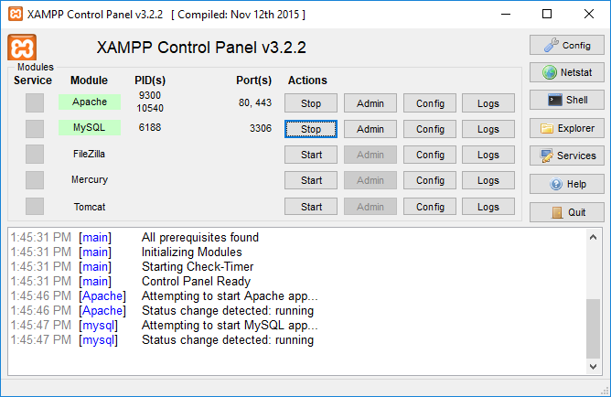

	

In this tutorial, you will learn how to integrate [WAX ExpressTrade](https://blog.opskins.com/opskins-expresstrade) into your website using [Node.js](#nodejs) or [PHP](#php)!

#### Table of Contents

* [Node.js](#nodejs)
* [PHP](#php)
	* [Beginners](#beginners)

# Node.js

# PHP

## Beginners

Before anything, you will need to install a **web server**, a **MySQL server** and **PHP**. If you already know how to do this, skip to the [next step](#beginners).

A web server, a MySQL server and PHP can be installed by many different means, although [XAMPP](https://www.apachefriends.org) is an all-in-one package that's incredibly easy to install and use; hence, it's a highly recommended option and you should definitely consider using it!

After installing XAMPP (or all of the above by any other mean), start **Apache** (the web server) and the **MySQL server**:

> **Note**: **Apache** and the **MySQL server** must be running for you to access your *unpublished* website. If you reboot your PC, you must open XAMPP and start both again. At the end of this tutorial, you will learn how to publish your website so that anyone around the world can visit it - it's only available to you for now!