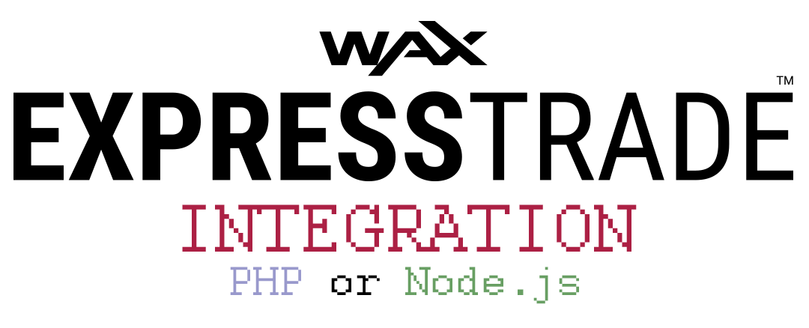
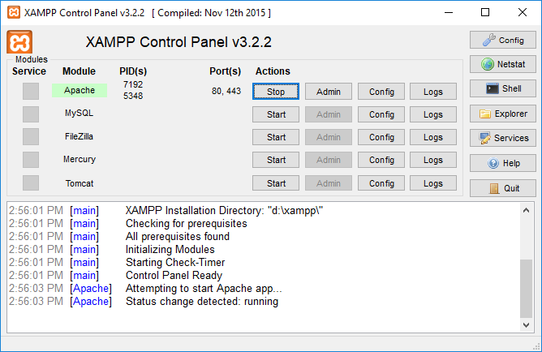
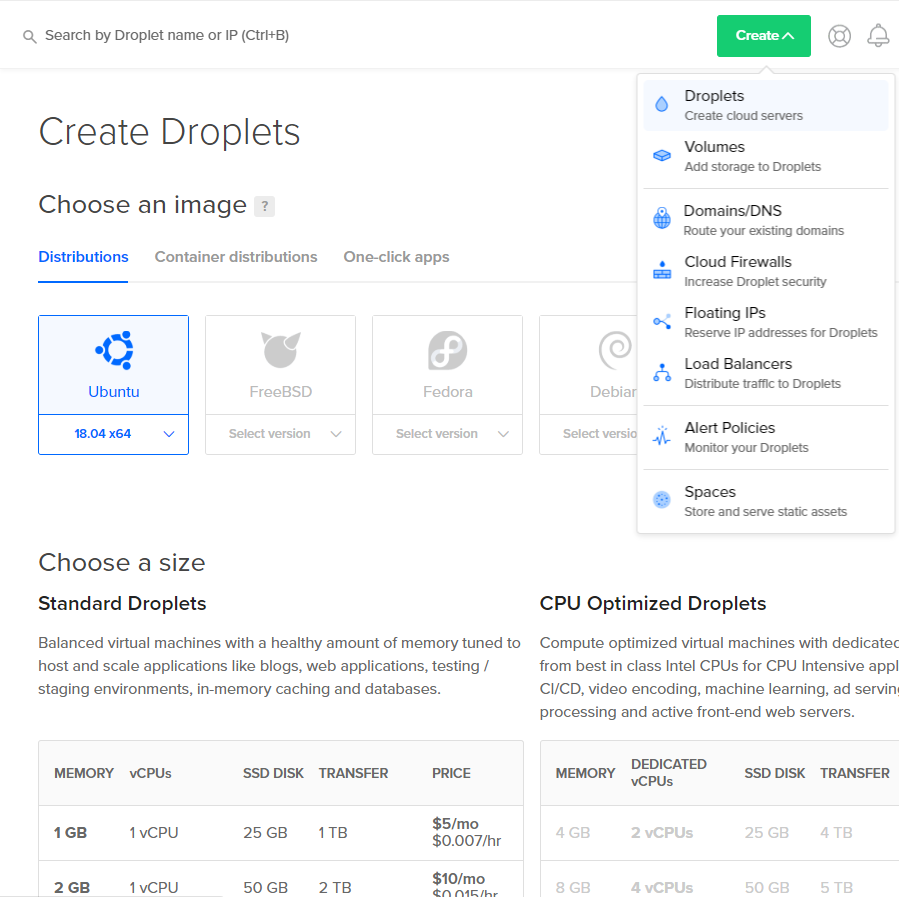
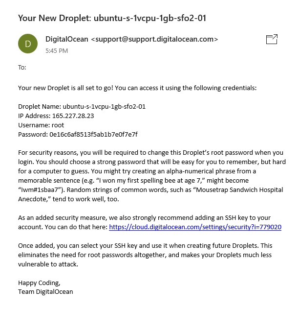
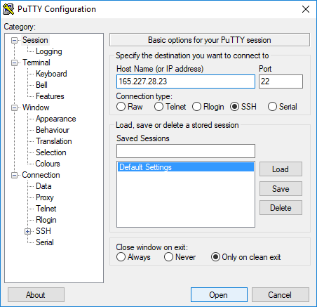
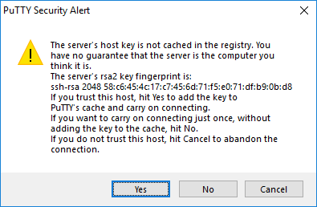
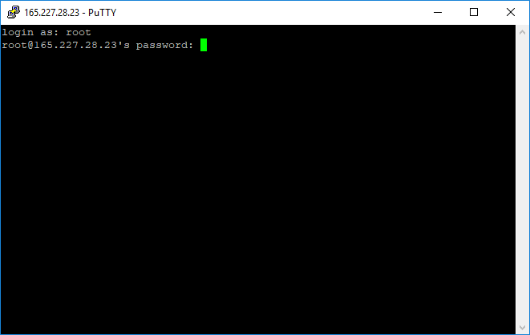
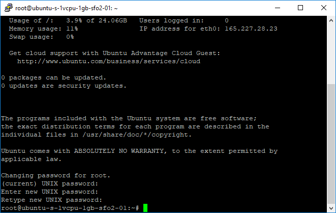
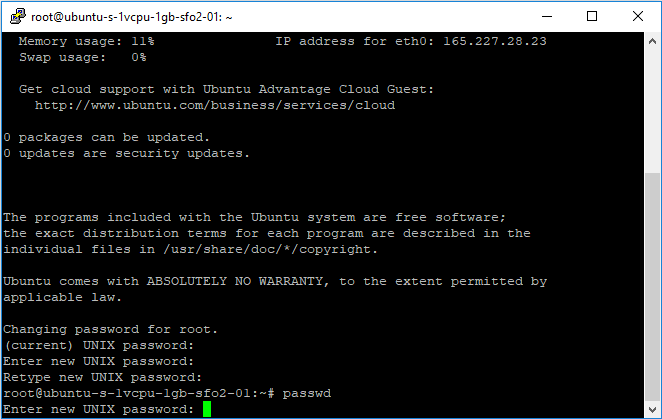
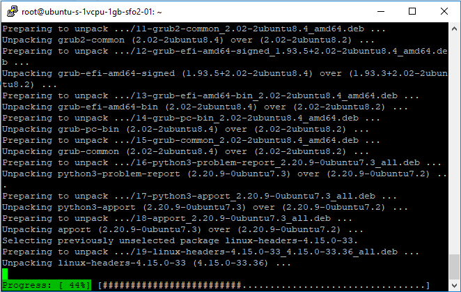

	

<table align = "center">
	<tr>
		<td align = "center">
			In this tutorial, you will learn how to integrate <a href = "https://github.com/OPSkins/trade-opskins-api">WAX ExpressTrade</a> into your website using <a href = "#nodejs">Node.js</a> or <a href = "#php">PHP</a>!
		</td>
	</tr>
	<tr>
		<td></td>
		<td align = "center">
			<table align = "center">
				<td align = "center">[API Documentation for WAX ExpressTrade](https://github.com/OPSkins/trade-opskins-api)</td>
				<td align = "center">[About WAX ExpressTrade](https://blog.opskins.com/opskins-expresstrade)</td>
			</table>
		</td>
	</tr>
</table>

#### Table of Contents

* [Node.js](#nodejs)
	* [Beginners](#beginners)
		* [Local Environment](#local-environment)
		* [Production Environment](#production-environment)
			* [Order/Create Your VPS](#ordercreate-your-vps)
			* [Log In & Prepare Your VPS](#log-in--prepare-your-vps)
			* [Create a New User](#create-a-new-user)
			* [Install Dependencies](#install-dependencies)
* [PHP](#php)
	* [Beginners](#beginners-1)
		* [Local Environment](#local-environment-1)
		* [Production Environment](#production-environment-1)
			* [Order/Create Your VPS](#ordercreate-your-vps-1)
			* [Log In & Prepare Your VPS](#log-in--prepare-your-vps-1)
			* [Create a New User](#create-a-new-user-1)
			* [Install Dependencies](#install-dependencies-1)

# Node.js

## Beginners

### Local Environment

### Production Environment

#### Order/Create Your VPS

#### Log In & Prepare Your VPS

#### Create a New User

#### Install Dependencies

# PHP

## Beginners

Before anything, you will need to install a **web server** and **PHP**. If you already know how to do this, skip to the [next step](#beginners-1).

### Local Environment

If you aren't interested in setting up an environment for local development, you can skip directly to [setting up a production environment](#production-environment-1) (preparing your website on a host) right off the bat.

A web server and PHP can be installed by many different means, although [XAMPP](https://www.apachefriends.org) is an all-in-one package that's incredibly easy to install and use; hence, it's a highly recommended option and you should definitely consider using it!

After installing XAMPP (or the above by any other mean), start **Apache** (the web server):

Any website you create should be placed in the `htdocs` folder where you installed XAMPP. You can access one of your websites at `http://localhost/some-website` via a web browser, where `some-website` is the path to the specific website you wish to render.

> **Note**: The **web server** must be running for you to access your *unpublished* website. If you reboot your PC, you must open XAMPP and start it again.

### Production Environment

Hosting your website implies that you rent a **VPS** (*Virtual Private Server*) from a company of choice to keep it accessible 24/7. There are many companies you can rent a VPS from, although some may require that you submit a whitelist application beforehand (such as [OVH](https://www.ovh.com/world)). If you're looking for a decent VPS that's also quick to set up, [DigitalOcean](https://www.digitalocean.com) is an excellent option!

#### Order/Create Your VPS

Regardless of the company you decide to rent your VPS from, you must get it online with the **OS** (*Operating System*) of your choice installed. **Ubuntu** is recommended for beginners.

Typically after creating a VPS, its log in credentials are sent via email - have them ready because you'll need them in the next step!

> **Note**: Hosting a website on a Windows server is possible; however, it isn't recommended for beginners - many network adjustments must be applied to prevent attacks by third parties.

#### Log In & Prepare Your VPS

You will need an **SSH client** in order to log into your VPS. [PuTTY](https://www.chiark.greenend.org.uk/~sgtatham/putty/latest.html) is a highly recommended option!

Run PuTTY and connect to your VPS:

A dialog titled `PuTTY Security Alert` will prompt, hit `Yes`:

Enter the username and password sent to you via email:

> **Note**: Passwords in the SSH client don't show whatsoever, not even as hidden characters (e.g. ••••••).

As stated in the email from DigitalOcean, you must change your password upon initially logging into your VPS for security reasons:

**(Optional)** Not all providers force you to change your password upon initially logging into your VPS, although it's recommended! You can alternatively change your password with the `passwd` command:

Check for and install all system updates by executing `apt update && apt upgrade`:

Clean any residue files by executing `apt autoclean && apt autoremove`:

#### Create a New User

No other command in this tutorial should be executed as `root`. Create a new user and add it to the `sudo` group so you'll have administrative privileges.

- Create the user, replacing `example_user` with a username of your choice: `adduser example_user` (you'll be prompt to assign a password and enter information about the user)
- Add the user to the `sudo` group, replacing `example_user` with the username of the user you previously created: `adduser example_user sudo`
- Switch to the user, again by replacing `example_user`: `su example_user`

#### Install Dependencies

If you're using Ubuntu 18.04, use Tasksel to install a **LAMP stack** (*Linux, Apache, MySQL, PHP*):

`sudo tasksel install lamp-server`

**(Optional)** Otherwise, you can install **Apache** and **PHP** separately (or if you don't want **MySQL** to be installed altogether):
- Install Apache: `sudo apt install apache2`
- Install the base PHP package and the PHP Extension and Application Repository: `sudo apt install php php-pear`
- Add the PHP module for Apache: `sudo apt install libapache2-mod-php`