<p align = "center">
	
</p>

<table>
	<tr>
		<td align = "center">
			In this tutorial, you will learn how to integrate the <a href = "https://github.com/OPSkins/trade-opskins-api">WAX ExpressTrade API</a> into your website in <a href = "#php-1">PHP</a> or <a href = "#nodejs-1">Node.js</a>!
		</td>
	</tr>
	<tr>
		<td>
			<table>
				<td align = "center">
					<a href = "https://trade.opskins.com">WAX ExpressTrade</a>
				</td>
				<td align = "center">
					<a href = "https://github.com/OPSkins/trade-opskins-api">API Documentation for WAX ExpressTrade</a>
				</td>
				<td align = "center">
					<a href = "https://docs.opskins.com/public/en.html#oauth">Documentation for OPSkins OAuth</a>
				</td>
				<td align = "center">
					<a href = "https://blog.opskins.com/opskins-expresstrade">About WAX ExpressTrade</a>
				</td>
				<td align = "center">
					<a href = "https://opskins.com">Buy/Sell Tradable Skins & Items</a>
				</td>
			</table>
		</td>
	</tr>
</table>

#### Table of Contents

* [Overview](#overview)
	* [Extensions](#extensions)
		* [PHP](#php)
			* [Recommended](#recommended)
			* [Other](#other)
		* [Node.js](#nodejs)
			* [Recommended](#recommended-1)
			* [Other](#other-1)
* [PHP](#php-1)
	* [Beginners](#beginners)
		* [Local Environment](#local-environment)
		* [Production Environment](#production-environment)
			* [Order/Create a VPS](#ordercreate-a-vps)
			* [Log In & Prepare Your VPS](#log-in--prepare-your-vps)
			* [Create a New User](#create-a-new-user)
			* [Install Dependencies](#install-dependencies)
			* [Register a Domain & Configure Name-based Virtual Hosts](#register-a-domain--configure-name-based-virtual-hosts)
	* [Set up an OPSkins Account](#set-up-an-opskins-account)
		* [Create an Account](#create-an-account)
		* [Enable 2FA (Two-Factor Authentication)](#enable-2fa-two-factor-authentication)
		* [Request an API Key](#request-an-api-key)
	* [Install Dependencies](#install-dependencies-1)
	* [Calling the API](#calling-the-api)
		* [Additional](#additional)
			* [Creating a special case-website user](#creating-a-special-case-website-user)
			* [Automatically receiving the $0.25 commission per case opened](#automatically-receiving-the-025-commission-per-case-opened)
* [Node.js](#nodejs-1)
	* [Beginners](#beginners-1)
		* [Local Environment](#local-environment-1)
		* [Production Environment](#production-environment-1)
			* [Order/Create a VPS](#ordercreate-a-vps-1)
			* [Log In & Prepare Your VPS](#log-in--prepare-your-vps-1)
			* [Create a New User](#create-a-new-user-1)
			* [Install Dependencies](#install-dependencies-2)
			* [Register a Domain & Configure Name-based Virtual Hosts](#register-a-domain--configure-name-based-virtual-hosts-1)
	* [Set up an OPSkins Account](#set-up-an-opskins-account-1)
		* [Create an Account](#create-an-account-1)
		* [Enable 2FA (Two-Factor Authentication)](#enable-2fa-two-factor-authentication-1)
		* [Request an API Key](#request-an-api-key-1)
	* [Install Dependencies](#install-dependencies-3)
	* [Calling the API](#calling-the-api-1)
		* [Additional](#additional-1)
			* [Creating a special case-website user](#creating-a-special-case-website-user-1)
			* [Automatically receiving the $0.25 commission per case opened](#automatically-receiving-the-025-commission-per-case-opened-1)

# Overview

There is no official **SDK** (*Software Development Kit*) for neither PHP nor Node.js; however, there are extensions you can use that contain all the tools needed to invoke the [WAX ExpressTrade API](https://github.com/OPSkins/trade-opskins-api) (the list of extensions can be found below). Depending whether you prefer [PHP](http://php.net) over JavaScript (specifically the [Node.js](https://nodejs.org) framework) or vice versa, one among them all is going to be the base to integrating the WAX ExpressTrade API into your website!

With the integration of the WAX ExpressTrade API, you can create a VGO case opening website (such as [UnlockVGO](https://www.unlockvgo.com)) and earn **$0.25** per case opened, set up a trading website where you can profit from each trade, etc.

Throughout this tutorial, there will be several `notes` to give you a brief insight of specific recommendations/topics.

## Extensions

### PHP

#### Recommended

- `execute_api_call.php` (it can be downloaded from this repository)

#### Other

- (None)

### Node.js

#### Recommended

- [node-expresstrade](https://github.com/TheTimmaeh/node-expresstrade)
- [node-wax-expresstrade](https://github.com/karer/node-wax-expresstrade)

#### Other

- (None)

Know of an extension that isn't listed above? [Open an issue](https://github.com/Kevin-Reinke/WAX_ExpressTrade_Integration/issues/new) and it will be added based on its functionality and quality!

> **Note**: Extensions prefixed with `official` were released by [OPSkins](https://opskins.com).

> **Note**: Although there are many different extensions you can use (not limited to the list above) to invoke the WAX ExpressTrade API, the first extension under `Recommended` in each category will be the extension used in this tutorial - you are free to use any other extension however!

# PHP

## Beginners

Before anything, you will need to install a **web server** and **PHP**. If you already know how to do this and you're not interested in registering a domain alongside the configuration that comes with it, skip to the [next step](#set-up-an-opskins-account). Otherwise, click [here](#register-a-domain--configure-name-based-virtual-hosts) for information related to registering a domain and its configuration!

> **Note**: Instructions related to setting up a **MySQL server** won't be addressed in this tutorial; however, it's recommended that you go forward with the process if you plan on creating a functional website that serves user accounts, saves their settings and/or stores any other data in general.

### Local Environment

If you aren't interested in setting up an environment for local development, you can skip directly to [setting up a production environment](#production-environment) (where you can publish your website so anyone can visit it) right off the bat.

---

A web server and PHP can be installed by many different means, although [XAMPP](https://www.apachefriends.org) is an all-in-one package that's incredibly easy to install and use; hence, it's a highly recommended option and you should definitely consider using it!

After installing XAMPP (or the above by any other mean), start **Apache** (or the web server):


Any website you create should be placed in the `htdocs` folder where you installed XAMPP. You can access one of your websites at `http://localhost/some-website` via a web browser, where `some-website` is the path to a specific website you wish to render.

### Production Environment

Hosting your website implies that you rent a **VPS** (*Virtual Private Server*) from a company of choice to keep it accessible 24/7. There are many companies you can rent a VPS from, although some may require that you submit a whitelist application beforehand (such as [OVH](https://www.ovh.com/world)). If you're looking for a decent VPS that's also quick to set up, [DigitalOcean](https://www.digitalocean.com) is an excellent option!

> **Note**: You can alternatively host your website with a dedicated web hosting provider (such as [HostGator](https://www.hostgator.com)), this would simplify the process a bit and can be a better option if your VPS provider doesn't provide strong protection against attacks using the default configuration. However, many dedicated web hosting providers disable certain features for security reasons - so if you want to be in complete control and/or plan on hosting more than one website while paying the same amount per month, a VPS would be the more convenient option!

#### Order/Create a VPS

Regardless of the company you decide to rent a VPS from, you must get it online with the **OS** (*Operating System*) of your choice installed. **Ubuntu** is recommended for beginners.


Typically after creating a VPS, its log in credentials are sent via email - have them ready because you'll need them in the next step!


> **Note**: Hosting a website on a Windows server is possible; however, it isn't recommended for beginners - many network adjustments must be applied to prevent attacks by third parties.

#### Log In & Prepare Your VPS

You will need an **SSH client** in order to log into your VPS. [PuTTY](https://www.chiark.greenend.org.uk/~sgtatham/putty/latest.html) is vastly recommended!

Run PuTTY (or the SSH client of your choice) and connect to your VPS:


A dialog titled `PuTTY Security Alert` will prompt, hit `Yes`:


Enter the username and password sent to you via email:


> **Note**: Passwords in the SSH client don't show whatsoever, not even as hidden characters (e.g. ••••••).

As stated in the email from DigitalOcean, you must change your password upon initially logging into your VPS for security reasons:


**(Optional)** Not all providers force you to change your password upon initially logging into your VPS, although it's recommended! You can alternatively change your password with the `passwd` command:


Check for and install all system updates by executing `apt update && apt upgrade`:


Remove any residue files by executing `apt autoclean && apt autoremove`:


#### Create a New User

No other command in this tutorial should be executed as `root` (besides the ones below to create a new user).

> **Note**: It's good practice to run your applications on a user level (as they were meant to) and leave administrative tasks to the root user. Your system is vulnerable to exploits and attacks when running applications as root, in consequence this can lead to files being deleted, breach of the root user's credentials or complete loss of your system. For even more security (e.g. preventing brute-force attacks), look into configuring SSH key based secure authentication.

---

Create a new user and add it to the `sudo` group so you'll have administrative privileges:

- Create the user, replacing `example_user` with a username of your choice: `adduser example_user` (you'll be prompt to assign a password and enter information about the user)
- Add the user to the `sudo` group, replacing `example_user` with the username of the user you previously created: `adduser example_user sudo`
- Switch to the user, again by replacing `example_user`: `su example_user`

> **Note**: Log into your VPS with the credentials you previously created from here on out (add `sudo` to the beginning of a command if administrative privileges is required); although, you can always use the `su` command to switch to the user.

#### Install Dependencies

If you're using Ubuntu 18.04, use Tasksel to install a **LAMP stack** (*Linux, Apache, MySQL, PHP*):

`sudo tasksel install lamp-server`

**(Optional)** Otherwise, you can install **Apache** and **PHP** separately (or if you don't want **MySQL** to be installed altogether):
- Install Apache: `sudo apt install apache2`
- Install the base PHP package and the PHP Extension and Application Repository: `sudo apt install php php-pear`
- Add the PHP module for Apache: `sudo apt install libapache2-mod-php`

Any website you create should be placed in `/var/www/html`. You can access one of your websites at `http://IP/some-website` via a web browser, where `IP` is your VPS' IP address and `some-website` is the path to a specific website you wish to render.

#### Register a Domain & Configure Name-based Virtual Hosts

Your website (or at least the `Apache2 Ubuntu Default Page`) should be accessible at this point. It's recommended that you assign a domain to your website if you plan on having visitors from all around the world; however, it isn't technically necessary - your visitors would just have trouble remembering your VPS' IP address! If you do not wish to assign a domain to your website, skip to the [next step](#install-dependencies-2).

---

There are many companies you can register a domain with. [NameCheap](https://www.namecheap.com) & [GoDaddy](https://www.godaddy.com) are excellent domain name providers, and both have an active support team! Either one is highly recommended.

Before you go ahead and purchase a domain, decide whether you want an **SSL certificate** or not since purchasing one after you register a domain is often more expensive (or you must pay the full price - no discount)! An SSL certificate will encrypt your visitors' information, thus improving the security of your website - it is recommended that you install one!

> **Note**: You aren't forced to pay for a domain as there are free options (such as [.tk](http://www.dot.tk)), but you are limiting the array of extensions available to you - either way, it is to note that some people tend to stay away from websites with free domains; therefore, go with a paid domain if you're aiming for success!

After registering a domain of your choice, modify its **host records**, replacing `165.227.28.23` with your VPS' IP address:

* **Type**: A Record, **Host**: @, **Value**: 165.227.28.23, **TTL**: Automatic
* **Type**: A Record, **Host**: www, **Value**: 165.227.28.23, **TTL**: Automatic

> **Note**: **@** is a shortcut for the name defined as origin ([*$ORIGIN*](http://www.zytrax.com/books/dns/ch8/origin.html)) - basically your domain name which also represents the root directory. The second host record will accept requests with the **www** subdomain attached.


> **Note**: When a domain is newly registered, or DNS changes are made, you can expect a propagation time up to 24 hours.

---

#### If you didn't purchase an SSL certificate, click [here](#if-you-purchased-an-ssl-certificate-click-here-to-continue) to continue.

It's great that you have decided to install an SSL certificate to ensure that the information of your visitors is protected (such as passwords) - now you need to activate it! For that, you will need to generate a CSR:

`openssl req -new -newkey rsa:2048 -nodes -keyout server.key -out server.csr` (you'll be prompt to enter information)

Once you have entered all of the requested information, you should have a `.csr` and `.key` file in the path where you executed the command. Open the `.csr` file with `nano` (install it by executing `sudo apt install nano` if it doesn't come pre-installed), copy its content, then go to your provider's dashboard and start the process of activating your SSL certificate (you can find your SSL certificate listed under `Products` on NameCheap).

Enter what you copied from the `.csr` file:


Confirm that the selected server is correct (should be/include **Apache** if you've been following the steps in this tutorial):


Select your preferred validation method:


Go forward with the selected domain ownership validation process. At the end, typically two files in a compressed archive will be sent to you via email - download it! With a **FTP client** ([FileZilla](https://filezilla-project.org) is highly recommended) connected through the `sftp` protocol (e.g. `sftp://IP`, where `IP` is your VPS' IP address - this is the value of `host` on the FTP client), upload the files in the compressed archive (`.crt` & `.ca-bundle`) to `/etc/ssl/certs` and upload the `.key` file that was generated alongside the `.csr` file to `/etc/ssl/private`. See the following screenshots for reference:


> **Note**: The `username` and `password` field on the FTP client correspond to your VPS log in credentials.

You will then need to enable SSL mode so that Apache is able to run an encrypted HTTPS connection:

`sudo a2enmod ssl`

Moving forward, it's now time to configure the name-based virtual hosts so that your system knows what to do when someone visits your domain! For that:

* Disable the default Apache virtual host: `sudo a2dissite *default`
* Create the necessary folders for your website, replacing `example.com` with your domain name: `sudo mkdir -p /var/www/html/example.com/{includes,public_html}`
* Create the virtual host file for your website, replacing `example.com` with your domain name: `sudo nano /etc/apache2/sites-available/example.com.conf` (the text editor will prompt, follow the step of your choice below)
* Paste the following configuration, replacing `example.com` with your domain name, `example_com_key` with the name of your `.key` file, `example_com_crt` with the name of your `.crt` file, and `example_com_ca_bundle` with the name of your `.ca-bundle` file:

	```
	<VirtualHost *:80>
		ServerName example.com
		ServerAlias www.example.com

		Redirect permanent / https://www.example.com/
	</VirtualHost>

	<VirtualHost *:443>
		ServerName example.com

		SSLEngine on
		SSLCertificateKeyFile /etc/ssl/private/example_com_key.key
		SSLCertificateFile /etc/ssl/certs/example_com_crt.crt
		SSLCACertificateFile /etc/ssl/certs/example_com_ca_bundle.ca-bundle

		Redirect permanent / https://www.example.com/
	</VirtualHost>

	<VirtualHost *:443>
		ServerName www.example.com

		SSLEngine on
		SSLCertificateKeyFile /etc/ssl/private/example_com_key.key
		SSLCertificateFile /etc/ssl/certs/example_com_crt.crt
		SSLCACertificateFile /etc/ssl/certs/example_com_ca_bundle.ca-bundle

		DirectoryIndex index.html index.php
		DocumentRoot /var/www/html/example.com/public_html
	</VirtualHost>
	```

* **(Optional)** The previous configuration will redirect requests to the root directory (`example.com`) to the `www` subdomain (`www.example.com`) while enforcing the `HTTPS` protocol. If you'd like the previous reversed (`www.example.com` redirects to `example.com`), paste the following instead (just remember to make the same replacements):

	```
	<VirtualHost *:80>
		ServerName example.com
		ServerAlias www.example.com

		Redirect permanent / https://example.com/
	</VirtualHost>

	<VirtualHost *:443>
		ServerName www.example.com

		SSLEngine on
		SSLCertificateKeyFile /etc/ssl/private/example_com_key.key
		SSLCertificateFile /etc/ssl/certs/example_com_crt.crt
		SSLCACertificateFile /etc/ssl/certs/example_com_ca_bundle.ca-bundle

		Redirect permanent / https://example.com/
	</VirtualHost>

	<VirtualHost *:443>
		ServerName example.com

		SSLEngine on
		SSLCertificateKeyFile /etc/ssl/private/example_com_key.key
		SSLCertificateFile /etc/ssl/certs/example_com_crt.crt
		SSLCACertificateFile /etc/ssl/certs/example_com_ca_bundle.ca-bundle

		DirectoryIndex index.html index.php
		DocumentRoot /var/www/html/example.com/public_html
	</VirtualHost>
	```

* Save the changes to the virtual host configuration file by pressing **CTRL** + **X**, hitting **Y** and then pressing **ENTER** to confirm.
* Enable your website by creating a symbolic link to your virtual host configuration file, replacing `example.com` with your domain name: `sudo a2ensite example.com.conf`

Finally, restart Apache for the changes to take effect:

`sudo systemctl restart apache2`

---

#### If you purchased an SSL certificate, click [here](#install-dependencies-2) to continue.

Configure the name-based virtual hosts so that your system knows what to do when someone visits your domain! For that:

* Disable the default Apache virtual host: `sudo a2dissite *default`
* Create the necessary folders for your website, replacing `example.com` with your domain name: `sudo mkdir -p /var/www/html/example.com/{includes,public_html}`
* Create the virtual host file for your website, replacing `example.com` with your domain name: `sudo nano /etc/apache2/sites-available/example.com.conf` (the text editor will prompt, follow the step of your choice below)
* Paste the following configuration, replacing `example.com` with your domain name:

	```
	<VirtualHost *:80>
		ServerName example.com

		Redirect permanent / http://www.example.com/
	</VirtualHost>

	<VirtualHost *:80>
		ServerName www.example.com

		DirectoryIndex index.html index.php
		DocumentRoot /var/www/html/example.com/public_html
	</VirtualHost>
	```

* **(Optional)** The previous configuration will redirect requests to the root directory (`example.com`) to the `www` subdomain (`www.example.com`). If you'd like the previous reversed (`www.example.com` redirects to `example.com`), paste the following instead (just remember to make the same replacement):

	```
	<VirtualHost *:80>
		ServerName www.example.com

		Redirect permanent / http://example.com/
	</VirtualHost>

	<VirtualHost *:80>
		ServerName example.com

		DirectoryIndex index.html index.php
		DocumentRoot /var/www/html/example.com/public_html
	</VirtualHost>
	```

* Save the changes to the virtual host configuration file by pressing **CTRL** + **X**, hitting **Y** and then pressing **ENTER** to confirm.
* Enable your website by creating a symbolic link to your virtual host configuration file, replacing `example.com` with your domain name: `sudo a2ensite example.com.conf`

Finally, restart Apache for the changes to take effect:

`sudo systemctl restart apache2`

## Set up an OPSkins Account

An [OPSkins](https://opskins.com) account is required for some endpoints of the [WAX ExpressTrade API](https://github.com/OPSkins/trade-opskins-api); therefore, it is recommended that you create one!

> **Note**: Although you can invoke the WAX ExpressTrade API without an OPSkins account, you are limiting the number of endpoints available to you. Features such as automatically receiving the **$0.25** commission (that is 10% of the base price of a [Skeleton Key](https://opskins.com/?app=1912_1&loc=shop_search&max=2.51&min=2.49&sort=lh&type=key)) per case opened from the [ICase](https://github.com/OPSkins/trade-opskins-api/tree/master/ICase)/[ICaseSite](https://github.com/OPSkins/trade-opskins-api/tree/master/ICaseSite) interface is also unavailable without an OPSkins account.

### Create an Account

You can create an OPSkins account by a) [signing in through Steam for the first time](https://opskins.com/?loc=login) or b) [entering your information in to a form](https://opskins.com/?loc=login&register):

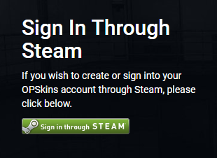

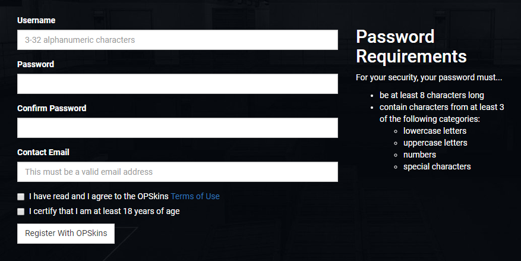

### Enable 2FA (Two-Factor Authentication)

Some [endpoints](https://github.com/OPSkins/trade-opskins-api) and [WAX ExpressTrade](https://trade.opskins.com) itself require **2FA** (*Two-Factor Authentication*) to be enabled on your account, you can do this with the help of your mobile device and the Google Authenticator app; however, it is recommended that you use a different app (this could also be an extension for your desktop browser, such as [Authenticator](https://chrome.google.com/webstore/detail/authenticator/bhghoamapcdpbohphigoooaddinpkbai?utm_source=chrome-ntp-icon) - highly recommended!) that shows you your `secret` as it is also required.

> **Note**: Your `secret` is required to generate a valid two-factor authentication code programmatically. For instance, the [SendOfferToSteamId](https://github.com/OPSkins/trade-opskins-api/blob/master/ITrade/SendOfferToSteamId.md) endpoint requires that you pass your current valid 2FA code in the request.

---

Go to your [OPSkins account security page](https://opskins.com/?loc=store_account#collapseSec) and hit the `Enable Two-Factor Authentication` button:

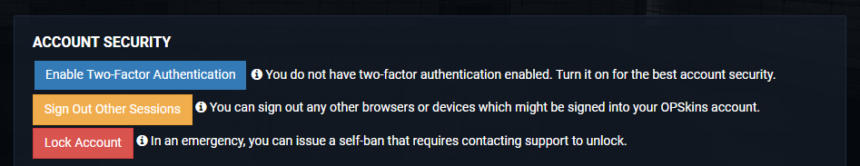

A modal will prompt asking you to enter a one-time code that was sent to your email. Get the code and enter it:


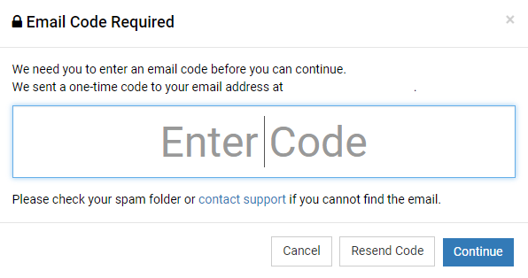

After submitting the one-time code, another modal will prompt. On the Authenticator browser extension (or with the 2FA app/extension of your choice - instructions may vary), click on the `Scan QR Code` icon located on the top right corner, select the barcode with your cursor by holding down left click on your mouse, and then let go:

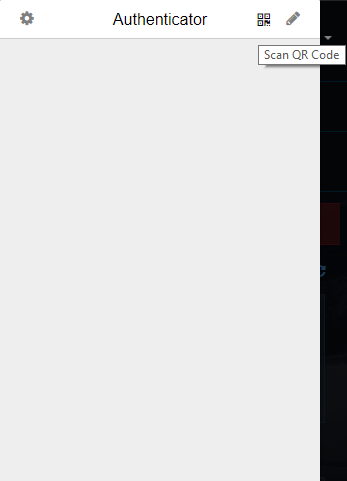

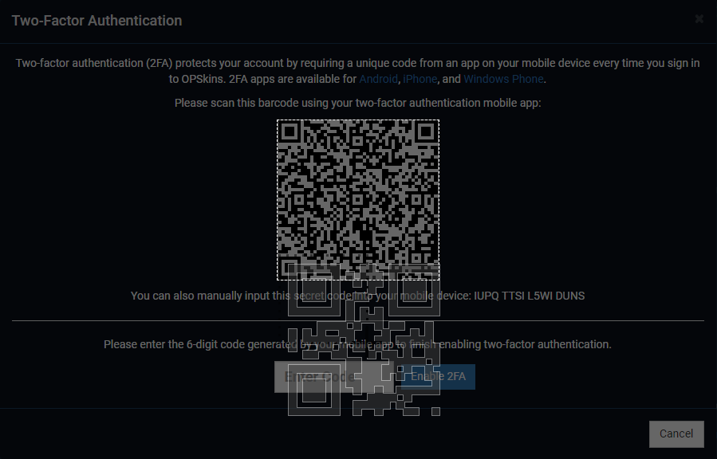

If the selection of the barcode was successful, a browser alert should prompt stating that your account has been added:

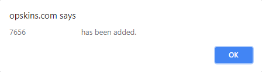

> **Note**: You can alternatively add your account by entering the secret shown on the second modal on Authenticator (this can be done by clicking on the `Edit` icon - it's located on the top far right corner). **This secret is the same secret (but without the whitespaces) you need to generate a valid two-factor authentication code programmatically; however, it is recommended that you learn how to obtain it from the Authenticator extension in case you lose/forget it in the future.**

On Authenticator, click on the `Settings` icon located on the top left corner and hit `Sync Clock with Google`:

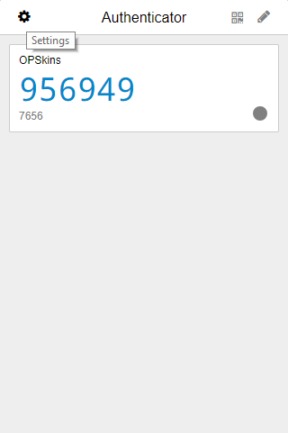

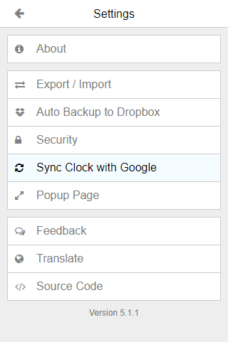

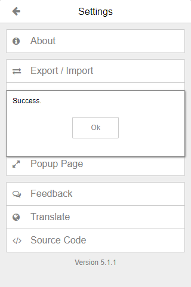

> **Note**: This step is vital, the shown two-factor authentication code may be invalid otherwise.

Enter the current valid two-factor authentication code shown on Authenticator:


After successfully enabling 2FA on your OPSkins account, you can now obtain your `secret` from the Authenticator extension! Click on the `Settings` icon, hit the `Export / Import` option, and then press the `Download Backup File` button:


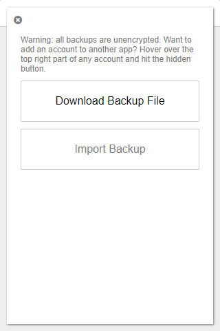

A `.json` file will begin to download. If you open it you'll see a similar multidimensional [JSON array](https://www.w3schools.com/js/js_json_arrays.asp) as to the one below:

```
{
	"3e44a51d4b5cad98c34f5f3658e35c73": {
		"account": "76569192284382175",
		"counter": 0,
		"encrypted": false,
		"hash": "3e44a51d4b5cad98c34f5f3658e35c73",
		"index": 0,
		"issuer": "OPSkins",
		"secret": "IUPQTTSIL5WIDUNS",
		"type": "totp"
	}
}
```

The only value you need from this `.json` file is `secret` (in case of the example above, that value is `IUPQTTSIL5WIDUNS`) - keep that value in hand as you may need it depending on the features you plan on adding to your website!

**(Optional)** If you are unfamiliar with JSON arrays and have more than one account added to Authenticator, you'll see more entires as shown below:

```
{
	"3e44a51d4b5cad98c34f5f3658e35c73": {
		"account": "76569192284382175",
		"counter": 0,
		"encrypted": false,
		"hash": "3e44a51d4b5cad98c34f5f3658e35c73",
		"index": 0,
		"issuer": "OPSkins",
		"secret": "IUPQTTSIL5WIDUNS",
		"type": "totp"
	},
	"313b6cb61386cb8f535cd74f2a5ea17c": {
		"account": "76561147468942173",
		"counter": 0,
		"encrypted": false,
		"hash": "313b6cb61386cb8f535cd74f2a5ea17c",
		"index": 0,
		"issuer": "OPSkins",
		"secret": "BVXFQ1S7YCDP71J4",
		"type": "totp"
	}
}
```

Simply find the right entry (base your search on the `account` index), make sure the `issuer` is `OPSkins` and get your `secret` from the array.

### Request an API Key

As there are endpoints that require a 2FA code, there also are endpoints that require an API key.

> **Note**: The [ICase](https://github.com/OPSkins/trade-opskins-api/tree/master/ICase)/[ICaseSite](https://github.com/OPSkins/trade-opskins-api/tree/master/ICaseSite) interface requires a completely different API key. That API key can be obtained by creating a special case-website user with the [CreateVCaseUser](https://github.com/OPSkins/trade-opskins-api/blob/master/IUser/CreateVCaseUser.md) endpoint.

---

Go to your [OPSkins advanced account options page](https://opskins.com/?loc=store_account#collapseAA), tick the `I have read and agree to the API Terms of Use` checkbox and hit the `Request API Key` button:

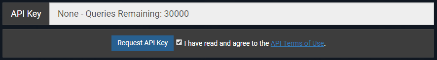

A modal will prompt, enter your 2FA code:

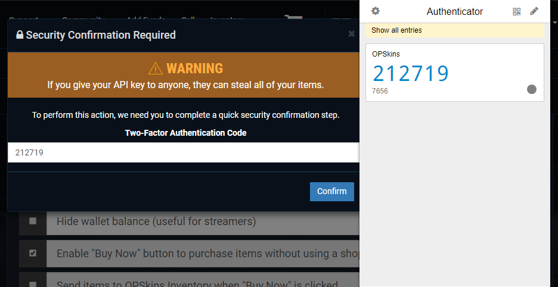

You will then be issued an API key - along with your 2FA `secret`, keep it in hand as you'll also need it depending on what you plan on adding to your website!

> **Warning!** If you give your API key to anyone, they can steal all of your items.

> **Note**: If you ever lose your API key or if you think it has been breached, you can always retrieve it or generate a new one on your [OPSkins advanced account options page](https://opskins.com/?loc=store_account#collapseAA).

## Install Dependencies

As stated in the [overview](#overview) at the beginning of the tutorial, the first extension under `Recommended` will be used - you are free to use any [other extension](#extensions) however!

Download `execute_api_call.php` (it can be downloaded from this repository) and place it inside your `includes` directory.

> **Note**: If you skipped the part of the tutorial where the `includes` folder was created, simply create the folder outside of your `public_html` directory. You should place any file that can be dynamically included from your `public_html` directory inside the `includes` folder.

> **Note**: If you are integrating the WAX ExpressTrade API into your website directly into a production environment and you didn't install an SSL certificate, you will need an **FTP client** ([FileZilla](https://filezilla-project.org) is highly recommended) to upload files to your VPS (click [here](#if-you-didnt-purchase-an-ssl-certificate-click-here-to-continue) and read the part addressing the use of an FTP client if you're having trouble connecting). If your website is hosted with a dedicated web hosting provider, you can use their web-based FTP client instead.

Create a `.php` file, name it `index.php`, place it inside of your `public_html` directory, open the file with a text editor ([Sublime Text](https://www.sublimetext.com/3) is recommended) and include `execute_api_call.php` (or you can download the `index.php` file in this repository and simply place it inside of your `public_html` folder). Your `index.php` file should contain the following:

```
<?php
	include_once "../includes/execute_api_call.php";
?>
```

> **Note**: The `index.html`/`index.php` file is the entry point of any website.

## Calling the API

Calling the [WAX ExpressTrade API](https://github.com/OPSkins/trade-opskins-api) implies that you either send a [GET](https://www.w3schools.com/tags/ref_httpmethods.asp) or [POST](https://www.w3schools.com/tags/ref_httpmethods.asp) request to `https://api-trade.opskins.com`, this will tell the server to perform an action on its end and return a response.

> **Note**: Calls to `api-trade.opskins.com` should always be executed over the `HTTPS` protocol; otherwise, your calls will be redirected and you will receive erroneous responses. `https://api-trade.opskins.com` is the default value for the `url` parameter in the `ExecuteAPICall` function (loaded from the `execute_api_call.php` extension).

---

All [endpoints](https://github.com/OPSkins/trade-opskins-api) of the WAX ExpressTrade API can be called using the same base structure. For instance, the [GetItems](https://github.com/OPSkins/trade-opskins-api/blob/master/IItem/GetItems.md) endpoint can be called as shown:

```
<?php
	include_once "../includes/execute_api_call.php";

	$response = ExecuteAPICall("GET", "IItem/GetItems/v1", array("key=Your API Key&sku_filter=100,102")); // method, endpoint, data (optional), url (optional - exists to call any other API besides WAX ExpressTrade)

	if($response != NULL) // check if the WAX ExpressTrade API responded
	{
		$data = json_decode($response, true); // return an array to easily process the response

		echo "status: " . $data['status'] . "<br><br>"; // example on how to access data in the array 

		var_dump($data); // output the response for debugging purposes
	}
	else
	{
		echo "The WAX ExpressTrade API didn't respond, it may be offline or under maintenance";
	}
?>
```

The `data` parameter in the `ExecuteAPICall` function should be structured differently when sending requests to endpoints that use the `POST` method:

```
array("key" => "Your API Key", "sku_filter" => "100,102")
```

> **Note**: Your `API key` should be passed as `key` (as shown above). The [API documentation for WAX ExpressTrade](https://github.com/OPSkins/trade-opskins-api) doesn't specifically state this.

All successful API responses have return data within the `response` object. A typical response may look like this:

```
{
	"status": 1,
	"time": 1528334546,
	"response": {
		"offer": {
			"some_data": "here"
		}
	}
}
```

> **Note**: If a response is paginated, the pagination details (`current_page` and `total_pages`) occur at the top-level of the object, not inside the `response` body.

All status codes and their titles can be found [here](https://github.com/OPSkins/trade-opskins-api/issues/19#issuecomment-403122935). In some instances, the status code may be an HTTP status code (e.g. 404).

> **Note**: OPSkins recognizes that mixing these codes isn't ideal. This will be fixed in the near future.

---

**Generating a valid two-factor authentication code programmatically**

Sync your clock with an **NTP server** (this will request the current time from a server):

`sudo apt install ntp -y`

> **Note**: This step is vital, the generated two-factor authentication code may be invalid otherwise.

> **Note**: If you are on Windows, click [here](https://developers.google.com/time/guides) for information on how to sync your clock with Google's Public NTP server (here's a [screenshot](https://github.com/Kevin-Reinke/WAX_ExpressTrade_Integration/blob/master/img/windows_sync_clock_with_google.png) for reference). If you're unable to sync your clock, you can always input your 2FA code manually solely for development purposes.

You can then use [OTPHP](https://github.com/lelag/otphp) (or any other similar extension) to generate a valid two-factor authentication code programmatically:

```
include_once "../includes/otphp/lib/otphp.php"; // remember to include/load extensions (note that this should only be done once per extension in a file - preferably at the beginning)

$totp = new \OTPHP\TOTP("Your 2FA Secret");
$code = $totp -> now();
```

> **Note**: Your 2FA code will be stored in the `$code` variable, pass it as the value of `twofactor_code` in the `data` parameter when sending requests to endpoints that require it.

---

**Granting access to OAuth scopes**

Use [php-oauth](https://github.com/OPSkins/php-oauth) for endpoints that require one or more [OAuth scopes](https://docs.opskins.com/public/en.html#scopes).

Modify the `OPSkinsOAuthSettings` class found in `OPSkinsOAuth.php` by entering your `API key`, the appropriate `redirect url` and the `name` of your website:

```
class OPSkinsOAuthSettings {

	static $opskinsAPIUrl = 'https://api.opskins.com/'; // do not change this
	static $opskinsAPIKey = 'Your API Key';

	static $opskinsOAuthURL = 'https://oauth.opskins.com/'; // do not change this
	static $opskinsOAuthReturnUri = 'http://localhost/'; // localhost for a local environment, the IP address of your VPS or your domain for a production environment (preferably your domain)
	static $siteName = 'Your Website Name'; // name shown beyond the authentication URL

	static $stateMappingFile = '/path/to/file/state_map'; // do not change this, or replace the file storage system with an MySQL database (experienced users only)
	static $clientsFileLocation = '/path/to/file/clients_file'; // do not change this, or replace the file storage system with an MySQL database (experienced users only)
}
```

Generate a URL and ask the user to authenticate (this will request access to the `identity` scope):

```
<?php
	include_once "../includes/OPSkinsOAuth.php";

	$auth = new OPSkinsOAuth();
	$client = $auth -> createOAuthClient(); // https://docs.opskins.com/public/en.html#IOAuth_CreateClient_v1
	$redirect_url = $auth -> getAuthUrl($client); // generate an authentication URL

	header("Location: " . $redirect_url); // redirect the user
?>
```

Request access to a specific array of scopes by modifying `$redirect_url = $auth -> getAuthUrl($client);` (list of scopes can be found [here](https://docs.opskins.com/public/en.html#scopes)):

```
$redirect_url = $auth -> getAuthUrl($client, ["identity", "trades"]);
```

After authenticating, the user will be redirected back to your website. Handle the response:

```
<?php
	$auth = new OPSkinsOAuth();
	$client = $auth -> verifyReturn($_GET['state'], $_GET['code']); // validate the returned data
	$auth -> getBearerToken($client); // token to access the OPSkins API on a user's behalf

	var_dump($auth -> testAuthed($client)); // output the response for debugging purposes
?>
```

> **Note**: Documentation for OPSkins OAuth can be found [here](https://docs.opskins.com/public/en.html#oauth).

### Additional

#### Creating a special case-website user

You will need an API key to invoke mostly all of the endpoints under the [ICase](https://github.com/OPSkins/trade-opskins-api/tree/master/ICase)/[ICaseSite](https://github.com/OPSkins/trade-opskins-api/tree/master/ICaseSite) interface.

> **Note**: This API key is different from your OPSkins API key.

Invoke the [CreateVCaseUser](https://github.com/OPSkins/trade-opskins-api/blob/master/IUser/CreateVCaseUser.md) endpoint from your SSH client, replacing `http://example.com` with your domain and `example` with your website's display name (e.g. shown on trade offers requesting keys):

```
curl -d '{"site_url":"http://example.com","display_name":"example"}' -H "Content-Type: application/json" -X POST https://api-trade.opskins.com/IUser/CreateVCaseUser/v1/
```

Upon your special case-website user being successfully created, the response printed in the SSH client will look similar to this:

```
{"status":1,"time":1536866982,"response":{"api_key":"c3ec795f41967f34209437b0005
258","user":{"id":-1054,"steam_id":"","display_name":"example.com","avatar":null
,"twofactor_enabled":false,"api_key_exists":true,"sms_phone":null,"contact_email
":null,"allow_twofactor_code_reuse":false,"inventory_is_private":true,"auto_acce
pt_gift_trades":false,"vcase_restricted":true}}}
```

The only value you need from the response is `api_key` (in case of the above, that value is `c3ec795f41967f34209437b0005258`).

> **Note**: Your `OPSkins API key`/`case-website API key` (one of the two) should be passed as `key`. The [API documentation for WAX ExpressTrade](https://github.com/OPSkins/trade-opskins-api) doesn't specifically state this.

#### Automatically receiving the $0.25 commission per case opened

You will need to link your OPSkins account to your `case-website API key` in order to receive the **$0.25** commission (that is 10% of the base price of a [Skeleton Key](https://opskins.com/?app=1912_1&loc=shop_search&max=2.51&min=2.49&sort=lh&type=key)) per case opened directly into your [USD Wallet](https://opskins.com).

Invoke the [UpdateCommissionSettings](https://github.com/OPSkins/trade-opskins-api/blob/master/ICaseSite/UpdateCommissionSettings.md) endpoint from your SSH client, replacing `Your OPSkins User ID` with your actual ID (you can get your OPSkins User ID on the [WAX ExpressTrade settings page](https://trade.opskins.com/settings)) and `Referral Commission Rate` with a floating point number ranging from `0.00` to `10.00` (`10.00` being every cent of the received commission):

```
curl -d '{"network_id":1,"network_user_id":Your OPSkins User ID,"referral_commission_rate":Referral Commission Rate}' -H "Content-Type: application/json" -X POST https://api-trade.opskins.com/ICaseSite/UpdateCommissionSettings/v1/
```

# Node.js

## Beginners

### Local Environment

### Production Environment

#### Order/Create a VPS

#### Log In & Prepare Your VPS

#### Create a New User

#### Install Dependencies

#### Register a Domain & Configure Name-based Virtual Hosts

## Set up an OPSkins Account

### Create an Account

### Enable 2FA (Two-Factor Authentication)

### Request an API Key

## Install Dependencies

## Calling the API

### Additional

#### Creating a special case-website user

#### Automatically receiving the $0.25 commission per case opened